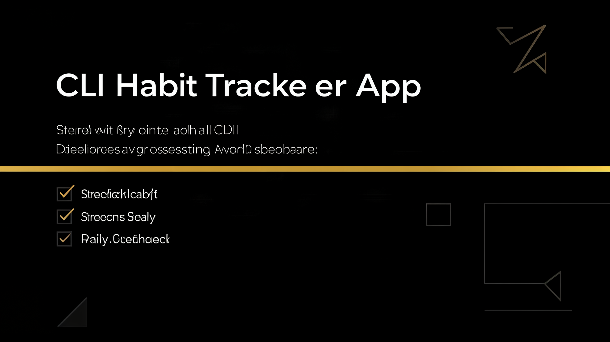

<p align="center">
  
</p>

---

# Habit Tracker CLI

A command-line habit tracking system. Create categories, register habits, log daily completions, and query compliance statistics and streaks.

## What it does

- Manage habit categories (health, study, work, etc.)
- Register habits with name, description, and frequency (daily, weekly, custom)
- Log daily completions
- View statistics: 7d/30d compliance rate, streaks (current and longest), records by day
- Search habits by name or description
- View today's logged habits

## Stack

- Python 3 (stdlib only: argparse, sqlite3, datetime)
- SQLite for local persistence
- No external dependencies

## Usage

```bash
python habit.py --help
python habit.py category --help
python habit.py habit --help
python habit.py log --help
python habit.py stats
python habit.py today
python habit.py streak
```

## Persistence

The database is stored at `~/.habit_tracker/habits.db` (SQLite). It is created automatically on first use.

## The Project

Repo from the [100 Days Challenge](/../../) — day 003 of 100.

Previous days:
- Day 001: [day-001-k8s-deployer](https://github.com/Holfkings/day-001-k8s-deployer) — Kubernetes manifests generator
- Day 002: [day-002-notes-cli](https://github.com/Holfkings/day-002-notes-cli) — CLI notes system with SQLite

---

**Author:** [@Holfkings](https://github.com/Holfkings) · Part of the [100 Days Challenge](https://github.com/Holfkings)
